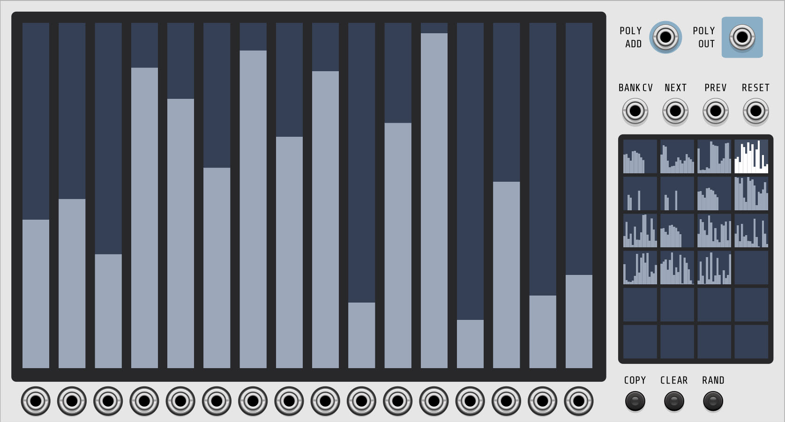

## Digital Programmer

Digital Programmer consists of 16 slides with both individual and polyphonic outputs.  These 16 CV signals would typically be used to control other modules.  In addition, there are 24 memory banks for storing and recalling slider positions.

### Outputs

* Each slider generates a voltage ranging from 0 to 10 volts available both below the slider and in the POLY output.  For example, if you have slider #5 set to 8.2 volts, that 8.2 volts will be output below the slider and via channel #5 in the poly output.

### Inputs

* The POLY ADD input is a polyphonic input.  Each of the 16 channels present at the POLY ADD input are added to the 16 slider values.  There's no requirement to use the POLY ADD input.
* BANK CV - This input takes a CV input ranging from 0 to 10 to select from bank 1 through 24.  When BANK CV is connected, it overrides the NEXT and PREV inputs.
* NEXT - Sets the next bank (left to right, top to bottom) , and wraps once it reaches the end.
* PREV - Sets the previous bank, and wraps once it reaches the beginning.
* RESET - Selects bank #1 as the active bank

### Copy, Clear, and Rand

#### Copy

Copy is used to copy a bank to one or more bank slots.  Here's how to copy a bank:

1. Make sure that the bank that you wish to copy is the active bank.  This is very important!
2. Click on the COPY button.  It will light up red.  You are now in copy/paste mode.
3. Click on 1 or more destination banks.  The source bank will be copied to these detinations and overwrite any existing information in those banks.
4. One you are done, click on the COPY button again to exit copy/paste mode.

#### Clear

Clear is used to clear one or more banks.

1. Click on the CLEAR button.  It will light up red.  You are now in clear mode.
2. Click on one or more banks to clear them.
3. One you are done, click on the CLEAR button again to exit clear mode.

#### Rand

RAND is used to randomize one or more banks.

1. Click on the RAND button.  It will light up red.  You are now in randomize mode.
2. Click on one or more banks to randomize them.  Clicking on a randomized bank will randomize it again!
3. One you are done, click on the RAND button again to exit randomize mode.
